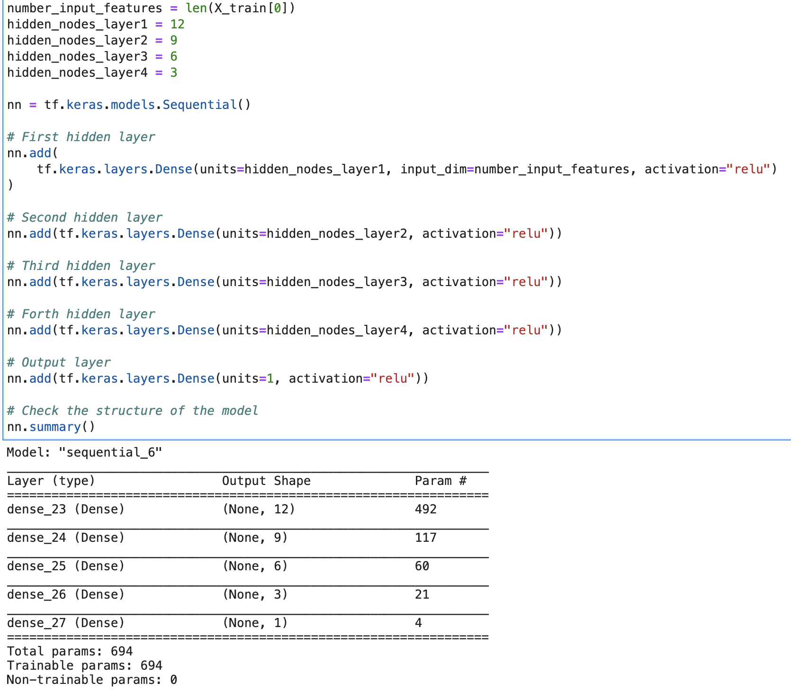
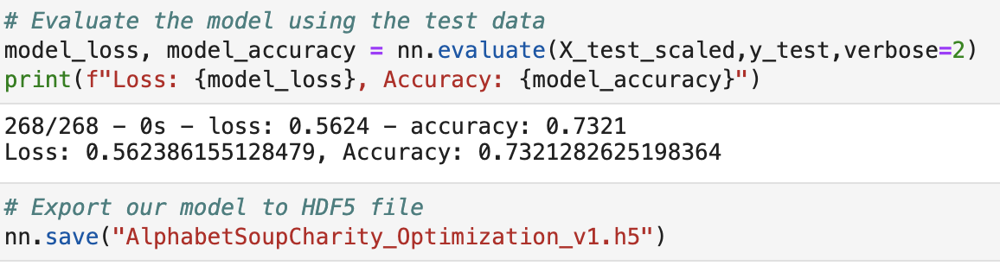
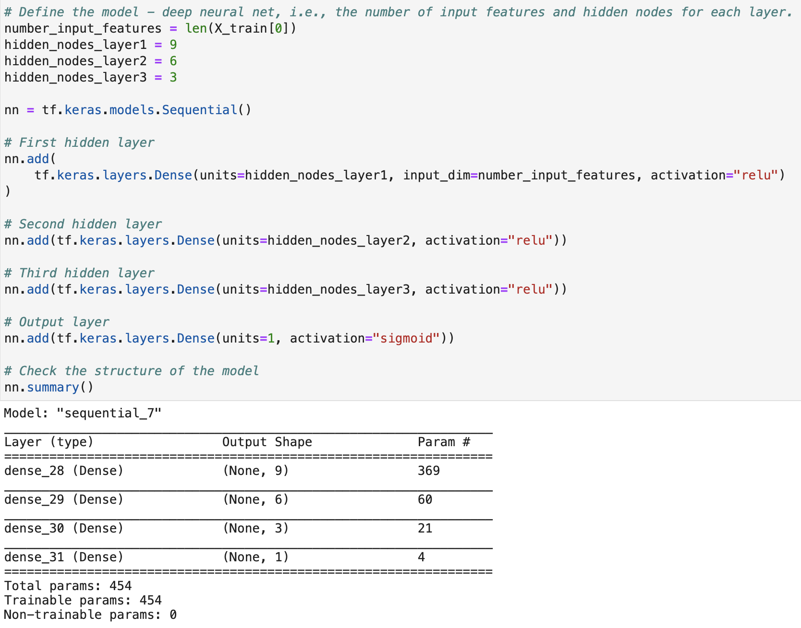
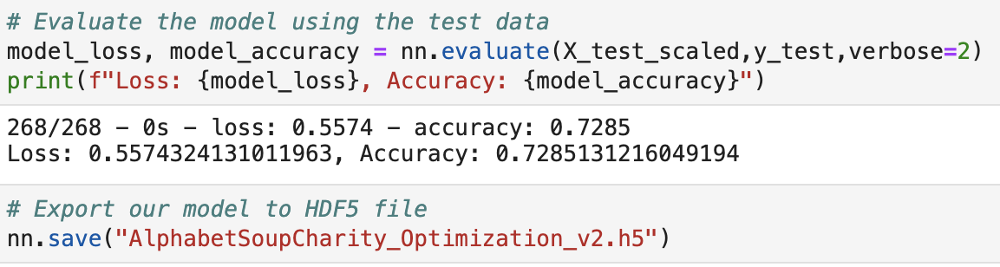
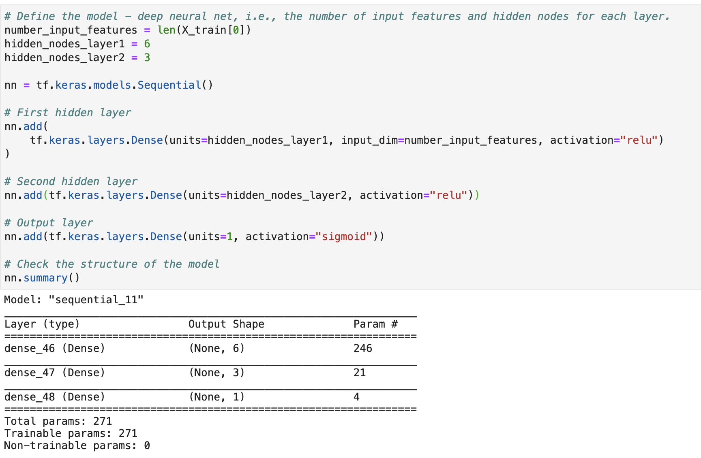
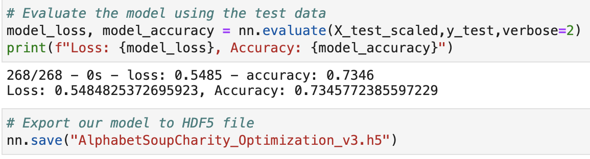

# Neural_Network_Charity_Analysis

## Project Overview:

We were tasked to help a company to create a binary classifier that is capable of predicting whether applicants will be successful if funded by the business. Using our knowledge of neural networks and machine learning, we will attempt to produce accurate results. 

---

## Resources: 

Software: Visual Studio Code, Jupyter Notebook/Lab, Python 3.8

Data Source: charity_data.csv

---

## Results:

### <b>Data Preprocessing:</b>

What variable(s) are considered the target(s) for your model?
* The column IS_SUCCESSFUL was the target for our model because it shows whether or not the model was used efficiently

What variable(s) are considered to be the features for your model?
* Our Feature columns were ASK_AMT, INCOME_AMT, SPECIAL_CONSIDERATIONS, STATUS, APPLICATION_TYPE, AFFILIATION, CLASSIFICATION, USE_CASE, ORGANIZATION

What variable(s) are neither targets nor features, and should be removed from the input data?
* The removed columns were EIN and NAME because they were just identification information.

### <b>Compiling, Training, and Evaluating the Model:</b>

How many neurons, layers, and activation functions did you select for your neural network model, and why?

* In V1, I used 12 neurons in layer 1, 9 in layer 2, 6 in layer 3 and, 3 in layer 4. I used relu for my activation function. I wanted to try to use 4 layers, in intervals of 3 to see if it would optimize results.

* The results were 73% accuracy

---

* In V2, I used 3 layers this time, keeping with the 3 neuron intervals. This time, I changed the output to sigmioid activation.

* The results were 73% accurate. Before rounding, it has decreased from the previous model

---

* In v3, narrowed down to 2 layers, only using 3 and 6 neurons. Kept the same Activation from last model

* The results were, again, 73%

---

Were you able to achieve the target model performance?
* We were unable to achieve 75% target model performance, averaging 73% every time.

What steps did you take to try and increase model performance?

* I tried to decrease the amount of neurons for each model, to see if too many layers were hindering the accuracy. 

---

## Summary:

We could not reach the target of 75% accuracy. every attempt would result in a similar outcome. If we were to try a different model, I would like to use supervised learning model, RandomForestClassifier. Since its a binary classification, we could get some outstanding results for our deep learning model.
